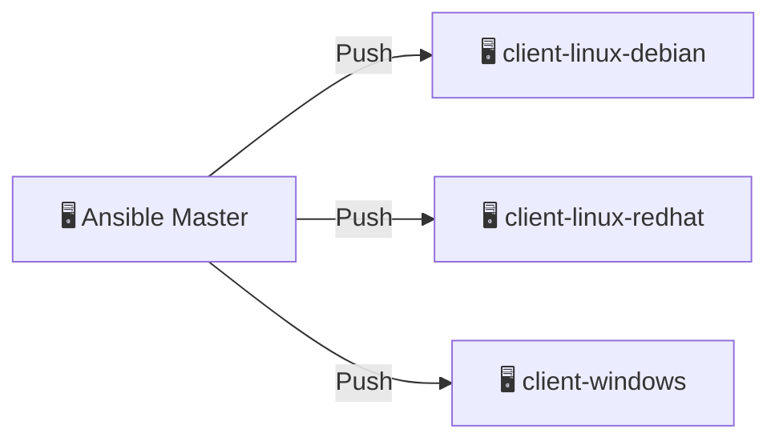

## Введение

Этот курс по основам Ansible построен на основе изолированного окружения, использующего Docker-контейнеры, Visual Studio Code и и плагин Dev Containers. Такое окружение позволяет быстро развернуть готовую платформу для изучения основ Ansible, не устанавливая ничего лишнего на вашу основную систему.

Для лучшего усвоения материала настоятельно рекомендуется повторить все шаги руководства вручную, создавая необходимые артефакты самостоятельно. Это поможет глубже понять процессы и лучше запомнить ключевые концепции.

- Пустой шаблон для прохождения курса с самого начала:
  <https://github.com/pprometey/ansible-tutorial-lab>
- Полный проект курса со всеми готовыми артефактами и историей разработки:
  <https://github.com/pprometey/ansible-tutorial-project>

### Как использовать это окружение для прохождения курса

1. **Установите Docker Desktop:**

    Для Windows, Mac или Linux — следуйте официальным инструкциям:
    <https://docs.docker.com/get-docker/>

2. **Клонируйте репозиторий курса:**

    ```bash
    git clone https://github.com/pprometey/ansible-tutorial-lab.git
    ```

    Перейдите в каталог склонированного репозитория, это и будет корневой каталог проекта:

    ```bash
    cd ansible-tutorial-lab
    ```

3. **Настройте переменную окружения для SSH-ключей:**

    - **Windows (PowerShell):**

    ```powershell
    [System.Environment]::SetEnvironmentVariable("DEFAULT_SSH_KEY", "<путь_к_папке_с_ключами>", "User")
    ```

    После этого перезапустите все окна VS Code.

    - **Mac/Linux (bash):**
    Добавьте в `~/.bashrc` или `~/.zshrc`:

    ```bash
    export DEFAULT_SSH_KEY="<путь_к_папке_с_ключами>"
    ```

    Затем выполните:

    ```bash
    source ~/.bashrc
    ```

    или перезапустите терминал.

    В указанной папке должны находиться два файла с именами id_rsa и id_rsa.pub, это приватный и публичный SSH-ключи, которые будут использоваться Ansible для подключения к целевым узлам.

4. **Проверьте, что переменная установлена:**

    - Windows (PowerShell):

    ```powershell
    $env:DEFAULT_SSH_KEY
    ```

    - Mac/Linux (bash):

    ```bash
    echo $DEFAULT_SSH_KEY
    ```

5. **Запустите изолированное окружение в VS Code с расширением Remote - Containers:**

    - Откройте VS Code выполнив команду `code .`
    - [Установите расширение **Remote - Containers**](https://marketplace.visualstudio.com/items?itemName=ms-vscode-remote.remote-containers) для VS Code, если оно еще не установлено.
    - Нажмите `F1` и выберите **Remote-Containers: Reopen in Container**.
      Это запустит контейнеры с Ansible-мастером и целевыми нодами.

## Что такое Ansible

**Ansible** — это инструмент управления конфигурациями (*Configuration Management Tool*), построенный по модели push: управляющий узел инициирует подключения к управляемым хостам по SSH и применяет конфигурации без установки дополнительного ПО на этих хостах.

Существуют два подхода к конфигурационному управлению:

- **Pull-модель** — на управляемые хосты устанавливаются агенты, которые самостоятельно забирают конфигурации с управляющего сервера (например, *Chef*, *Puppet*, *SaltStack*).
- **Push-модель** — управляющий сервер самостоятельно подключается к хостам и применяет конфигурации (например, *Ansible*).



### Минимальные требования

**Управляющий сервер (master):**

- Только Linux
- Python версии 2.6+ или 3.5+

**Управляемые серверы (managed):**

- **Linux:** пользователь с правами администратора и доступ по паролю или SSH-ключу, Python 2.6+
- **Windows:** пользователь с правами администратора, PowerShell версии 3.0+, запуск скрипта `ConfigureRemotingForAnsible.ps1`

### Установка Ansible

Поскольку мы испльзуем уже готовое и настроенное окружение, этот мы можем пропустить. Но ознакомиться с инструкцией по установке можно на официальном сайте:  
<https://docs.ansible.com/ansible/latest/installation_guide/intro_installation.html>

## Шаг 1. Подключение к клиентам и инвентори-файл

Первым шагом необходимо создать **inventory-файл** — это файл, в котором описываются целевые хосты и группы хостов для управления.

### Возможные имена inventory-файлов

- `/etc/ansible/hosts` — системный файл по умолчанию
- Любой другой файл, указанный параметром `-i` при запуске
- Часто используются:
  - `hosts`
  - `inventory`
  - `production`, `staging`, `dev` — по окружениям
  - `inventory.ini`, `inventory.yaml`, `inventory.json` — в зависимости от формата

### Типы inventory

- **Статический**: простой файл (`.ini`, `.yaml`, `.json`)
- **Динамический**: скрипт или плагин, возвращающий список хостов на лету

Создадим файл `hosts` в корне проекта и определим хосты и параметры подключения:

```ini
[minions]
minion1 ansible_user=developer ansible_ssh_private_key_file=/home/developer/.ssh/id_rsa ansible_python_interpreter=/usr/bin/python3
minion2 ansible_user=developer ansible_ssh_private_key_file=/home/developer/.ssh/id_rsa ansible_python_interpreter=/usr/bin/python3
```

Теперь можно выполнить проверку соединения, выполнив команду:

```bash
ansible -i hosts all -m ping
```

Пояснения к параметрам:

- `-i hosts` — указание пути к inventory-файлу
- `all` — применить ко всем хостам
- `-m ping` — использовать модуль `ping`

Ожидаемый результат:

```bash
minion2 | SUCCESS => {
    "changed": false,
    "ping": "pong"
}
minion1 | SUCCESS => {
    "changed": false,
    "ping": "pong"
}
```

### Проверка ключа SSH

При первом подключении к хосту SSH запросит подтверждение подлинности:

```sh
The authenticity of host 'minion2 (172.18.0.2)' can't be established.
ED25519 key fingerprint is SHA256:WW96QnhRxdH6bes4Jb7XizPiJxmICoQUu/dDokoRm/M.
Are you sure you want to continue connecting (yes/no/[fingerprint])?
```

Что происходит:

- SSH-клиент не знает публичного ключа хоста.
- Он показывает *отпечаток* ключа и просит подтвердить, что вы доверяете серверу.
- После подтверждения ключ сохраняется в `~/.ssh/known_hosts`.
- В дальнейшем при подключении будет проверяться соответствие ключа — это защита от MITM-атак.

Можно отключить эту проверку (в целях разработки), но **в продакшене это крайне не рекомендуется**.

Создадим файл `ansible.cfg`:

```ini
[defaults]
host_key_checking = false
inventory = ./hosts
```

Теперь можно запускать команды без указания `-i hosts`.

---

## Правила создания inventory-файла

Примеры:

```ini
# Просто IP-адреса
10.0.15.12
10.0.15.13

# Алиас и параметры
ansible-debian ansible_host=10.0.15.12
```

### Группировка хостов

```ini
[group_name]
hostname ansible_host=10.0.15.12
```

По умолчанию доступны две группы:

- `all` — все хосты
- `ungrouped` — хосты, не входящие ни в одну группу

Показать структуру можно командой:

```bash
ansible-inventory --graph
```

Пример вывода:

```bash
@all:
  |--@ungrouped:
  |  |--10.0.15.11
  |--@cluster_servers:
  |  |--@master_servers:
  |  |  |--control1
  |  |--@worker_servers:
  |  |  |--worker1
  |  |  |--worker2
```

### Вложенные группы (`:children`)

```ini
10.0.15.11

[master_servers]
control1 ansible_host=10.0.15.12

[worker_servers]
worker1 ansible_host=10.0.15.13
worker2 ansible_host=10.0.15.14

[cluster_servers:children]
master_servers
worker_servers
```

Можно создавать и более глубокие уровни вложенности:

```ini
[all_cluster_servers:children]
cluster_servers
cluster2_servers
```

### Общие переменные для групп (`:vars`)

```ini
[cluster_servers:children]
master_servers
worker_servers

[cluster_servers:vars]
ansible_user=developer
ansible_ssh_private_key_file=/home/developer/.ssh/id_rsa
ansible_python_interpreter=/usr/bin/python3
```

Итоговый пример файла `hosts`:

```ini
[master_servers]
minion1

[worker_servers]
minion2

[cluster_servers:children]
master_servers
worker_servers

[cluster_servers:vars]
ansible_user=developer
ansible_ssh_private_key_file=/home/developer/.ssh/id_rsa
ansible_python_interpreter=/usr/bin/python3
```

## Шаг 2. Выполнение ad-hoc команд и основные модули Ansible

**Ad-hoc команды** — это однократные команды, которые выполняются напрямую из командной строки, без написания плейбуков. Все действия в Ansible выполняются с помощью *модулей*.

Простейший пример:

```bash
ansible all -m ping
```

Эта команда говорит Ansible выполнить на всех хостах, указанных в inventory-файле, модуль `ping`, который просто проверяет доступность машин.

Для получения подробной служебной информации можно использовать параметр `-v` (verbose):

- `-v` — краткий вывод
- `-vv` — подробный
- `-vvv` — максимально подробный

Пример:

```bash
ansible cluster_servers -m shell -a "ls -lpa /home/developer" -vvv
```

Список всех доступных модулей можно посмотреть командой:

```bash
ansible-doc -l
```

---

### Основные модули Ansible

#### `setup`

Модуль `setup` собирает факты о целевой системе:

```bash
ansible master_servers -m setup
```

Он возвращает подробную информацию об ОС, архитектуре, сетевых интерфейсах и т.д.

---

#### `shell`

Модуль `shell` позволяет запускать команды оболочки (bash/sh):

```bash
ansible all -m shell -a "uptime"
```

Пример вывода:

```bash
minion1 | CHANGED | rc=0 >>
 13:35:43 up 32 min,  0 users,  load average: 0.02, 0.07, 0.09
```

---

#### `shell` vs `command`

Оба модуля позволяют выполнять команды, но с важным отличием:

- `shell` использует оболочку (bash/sh) — поддерживает переменные окружения, `>`, `|`, `&&`, `*` и т.д.
- `command` — вызывает команды напрямую, без оболочки.

Пример:

```bash
ansible all -m shell -a "ls /home/developer"
ansible all -m command -a "ls /home/developer"
```

Модуль `shell` предпочтителен для сложных команд, но менее безопасен — не используйте его с необработанными переменными.

---

#### `copy`

Модуль `copy` копирует файлы с управляющего хоста на управляемые.

Пример (предварительно создайте файл `hi.txt` в корне проекта):

```bash
ansible all -m copy -a "src=hi.txt dest=/home/developer mode=0777"
```

Если нужно выполнить копирование от имени администратора (`sudo`), добавьте `-b`:

```bash
ansible all -m copy -a "src=hi.txt dest=/home mode=0777" -b
```

Флаг `-b` (`--become`) означает выполнение от имени пользователя с правами root.

---

#### `file`

Модуль `file` позволяет изменять свойства файлов и директорий (создавать, удалять, изменять права и владельца).

Пример удаления файла:

```bash
ansible all -m file -a "path=/home/hi.txt state=absent" -b
```

Повторный запуск этой команды не приведёт к ошибке — Ansible сообщит `"changed": false`, если файл уже отсутствует:

```bash
minion1 | SUCCESS => {
    "changed": false,
    "path": "/home/hi.txt",
    "state": "absent"
}
```

---

#### `get_url`

Позволяет скачивать файлы из интернета:

```bash
ansible all -m get_url -a "url=https://raw.githubusercontent.com/pprometey/ansible-learning-template/refs/heads/main/README.md dest=/home/developer"
```

Для получения содержимого (а не просто скачивания файла), используйте:

```bash
ansible all -m uri -a "url=https://example.com return_content=yes"
```

---

#### `yum` и `apt`

Для управления пакетами на разных типах ОС:

**RedHat/AlmaLinux/CentOS:**

```bash
ansible all -m yum -a "name=stress state=present" -b
ansible all -m yum -a "name=stress state=absent" -b
```

**Debian/Ubuntu:**

```bash
ansible all -m apt -a "name=stress state=present update_cache=yes" -b
ansible all -m apt -a "name=stress state=absent" -b
```

Флаг `update_cache=yes` рекомендуется перед установкой в Debian-системах.

---

#### `uri`

Модуль `uri` используется для HTTP(S)-запросов:

```bash
ansible all -m uri -a "url=https://iit.kz"
```

Чтобы получить содержимое:

```bash
ansible all -m uri -a "url=https://iit.kz return_content=yes"
```

---

#### `service`

Модуль для управления сервисами (службами):

Запуск и включение в автозагрузку:

```bash
ansible all -m service -a "name=httpd state=started enabled=yes" -b
```

Остановка сервиса:

```bash
ansible all -m service -a "name=httpd state=stopped" -b
```

> Обратите внимание: модуль `service` не удаляет пакеты, для этого используйте `apt` или `yum`.

---

Это основные ad-hoc команды и модули, с которых начинается работа в Ansible. Они позволяют быстро проверять состояние серверов и выполнять базовые действия без написания плейбуков.

## Шаг 3. Yaml, group_vars, host_vars

### Основы YAML

YAML — это текстовый формат для хранения структурированных данных. Файлы YAML имеют расширение `.yaml` или `.yml`.

**Основные правила YAML:**

1. Используются отступы (пробелы) для обозначения вложенности. На одном уровне вложенности — одинаковое число пробелов.
2. Списки оформляются с использованием символа `-` и пробела.
3. Пары "ключ-значение" записываются через двоеточие с пробелом: `ключ: значение`.
4. Имя можно указывать как поле (`name: Alexey`) или как ключ (`Alexey:`).  
   Если имя указано как ключ, после него обязательно должно быть двоеточие.
5. Поддерживается краткая запись через фигурные скобки:  
   `{name: ..., age: ..., skills: [...]}` или `Имя {age: ..., skills: [...]}`.
6. Для краткой записи списков используются квадратные скобки: `skills: [Python, C#, YAML]`  
   Это эквивалент многострочной записи со `-`.
7. Если в значении встречается двоеточие (`:`), строку следует заключать в кавычки:  
   `nickname: "Anton: god"` — иначе будет синтаксическая ошибка.

**Пример:** все четыре записи ниже эквивалентны и валидны:

```yaml
---
- name: Alexey
  nickname: Alex
  age: 35
  skills:
    - Python
    - C#
    - YAML

- Anton:
    nickname: "Anton: thebest"
    age: 30
    skills:
      - Продажи
      - Маркетинг

- {name: Sasha, age: 60, skills: ['FoxPro', 'Работа по дереву']}

- Nina { age: 56, skills: ['Готовка', 'Садоводство: Кабачки'] }
...
```

**Одинарные кавычки `'...'`:**

- Всё содержимое воспринимается буквально, без интерпретации.
- Чтобы вставить одинарную кавычку внутрь строки, её нужно удвоить:  
  `'Это ''пример'' текста'` -> `Это 'пример' текста`.
- Переносы строк внутри таких кавычек запрещены.

**Двойные кавычки `"..."`:**

- Поддерживают escape-последовательности:
  - `\n` — перенос строки
  - `\t` — табуляция
  - `\"` — двойная кавычка внутри строки
- Можно формировать многострочные строки при помощи специальных приёмов.

**Итог:**

- Одинарные кавычки — для простых строк без спецсимволов.
- Двойные — если нужны спецсимволы или переносы строк.
- Обе разновидности кавычек защищают строку от ошибочного синтаксического анализа (например, из-за двоеточий).

---

### Переменные в `group_vars`

В крупных проектах переменные, общие для группы хостов, принято хранить в каталоге `group_vars`. В этом каталоге создаются YAML-файлы с именами групп, указанных в инвентори-файле.

**Изначальный файл инвентаризации:**

```ini
[master_servers]
minion1

[worker_servers]
minion2

[cluster_servers:children]
master_servers
worker_servers

[cluster_servers:vars]
ansible_username=developer 
ansible_ssh_private_key_file=/home/developer/.ssh/id_rsa
ansible_python_interpreter=/usr/bin/python3
```

**Шаги:**

1. Создай каталог `group_vars` в корне проекта.
2. Внутри — файл `cluster_servers.yml`:

    ```yaml
    ---
    ansible_username: developer 
    ansible_ssh_private_key_file: /home/developer/.ssh/id_rsa
    ansible_python_interpreter: /usr/bin/python3
    ```

3. Удали блок `[cluster_servers:vars]` из инвентаризации — Ansible сам подгрузит переменные из соответствующего YAML-файла:

    ```ini
    [master_servers]
    minion1

    [worker_servers]
    minion2

    [cluster_servers:children]
    master_servers
    worker_servers
    ```

### Переменные в `host_vars`

Аналогично `group_vars`, для хранения уникальных переменных конкретных хостов используется каталог `host_vars`.

Ansible автоматически подгружает переменные из этого каталога при работе с соответствующими хостами.

**Шаги:**

1. Создай каталог `host_vars` в корне проекта.
2. Создай в нем файл с именем хоста (например, `minion1.yml`).
3. В этом файле укажи переменные, специфичные для данного хоста в YAML-формате:

```yaml
---
some_unique_var: true
custom_port: 2222
```

Такой подход помогает держать файл инвентаризации чистым и упрощает сопровождение при росте инфраструктуры.

## Шаг 4. Плейбуки (Playbooks)

Playbook — это YAML-файл с определённой структурой, в котором указано несколько команд Ansible, выполняющих определённую цель. Как правило, файлы с плейбуками хранятся в каталоге `playbooks`, который находится в корне проекта.

### Первый Playbook

Напишем первый плейбук, который будет выполнять проверку соединения с хостами, выполнив команду `ping`. Для этого создадим в каталоге `playbooks` файл `ping.yml` со следующим содержимым:

```yaml
---
- name: Test connection to my servers  # Имя плейбука
  hosts: all                           # К каким хостам применять
  become: yes                          # Использовать sudo

  tasks:                               # Массив задач плейбука
    - name: Ping my servers            # Имя задачи
      ping:                            # Модуль, используемый в задаче
```

Запустим плейбук:

```bash
ansible-playbook playbooks/ping.yml
```

Пример вывода:

```bash
PLAY [Test connection to my servers]

TASK [Gathering Facts]
ok: [minion1]
ok: [minion2]

TASK [Ping my servers]
ok: [minion2]
ok: [minion1]

PLAY RECAP
minion1 : ok=2  changed=0  unreachable=0  failed=0  skipped=0  rescued=0  ignored=0
minion2 : ok=2  changed=0  unreachable=0  failed=0  skipped=0  rescued=0  ignored=0
```

### Второй плейбук - установка веб-сервера nginx

Теперь создадим плейбук для установки веб-сервера nginx на системы, совместимые с Debian. В каталоге `playbooks` создадим файл `install_nginx.yml` со следующим содержимым:

```yaml
---
- name: Install Nginx on Debian-like systems
  hosts: all
  become: true

  tasks:
    - name: Update apt cache
      apt:
        update_cache: yes  # Обновить кэш пакетов, чтобы получить актуальную информацию

    - name: Install nginx
      apt:
        name: nginx        # Имя пакета
        state: present     # Убедиться, что пакет установлен

    - name: Ensure nginx is running and enabled
      service:
        name: nginx        # Имя сервиса
        state: started     # Сервис должен быть запущен
        enabled: yes       # Включить автозапуск при загрузке
```

Запускаем плейбук:

```bash
ansible-playbook playbooks/install_nginx.yml
```

Пример вывода:

```bash
PLAY [Install Nginx on Debian-like systems]

TASK [Gathering Facts]
ok: [minion2]
ok: [minion1]

TASK [Update apt cache]
changed: [minion2]
changed: [minion1]

TASK [Install nginx]
changed: [minion2]
changed: [minion1]

TASK [Ensure nginx is running and enabled]
changed: [minion1]
changed: [minion2]
```

Проверим установку, запросив веб-страницу с сервера. Для этого выполним команду:

```bash
curl minion1
```

Если всё работает корректно, вы увидите стандартную HTML-страницу по умолчанию для веб-сервера nginx:

```html
<!DOCTYPE html>
<html>
<head>
<title>Welcome to nginx!</title>
<style>
html { color-scheme: light dark; }
body { width: 35em; margin: 0 auto;
font-family: Tahoma, Verdana, Arial, sans-serif; }
</style>
</head>
<body>
<h1>Welcome to nginx!</h1>
<p>If you see this page, the nginx web server is successfully installed and
working. Further configuration is required.</p>

<p>For online documentation and support please refer to
<a href="http://nginx.org/">nginx.org</a>.<br/>
Commercial support is available at
<a href="http://nginx.com/">nginx.com</a>.</p>

<p><em>Thank you for using nginx.</em></p>
</body>
</html>
```

### Идемпотентность в Ansible

Идемпотентность в Ansible означает, что повторный запуск плейбука не изменит систему, если она уже находится в нужном состоянии.

Ключевые моменты:

- Один и тот же плейбук можно запускать многократно — результат останется одинаковым.
- Ansible автоматически проверяет, нужно ли применять изменения (например, не переустанавливает nginx, если он уже установлен).
- Это обеспечивает надёжность и безопасность автоматизации.

Например, при повторном запуске плейбука установки веб-сервера nginx (`ansible-playbook playbooks/install_nginx.yml`) мы увидим следующий вывод:

```bash
PLAY [Install Nginx on all servers] 

TASK [Gathering Facts] 
ok: [minion2]
ok: [minion1]

TASK [Update apt cache] 
ok: [minion2]
ok: [minion1]

TASK [Install nginx] 
ok: [minion1]
ok: [minion2]

TASK [Ensure nginx is running and enabled] 
ok: [minion2]
ok: [minion1]

PLAY RECAP 
minion1                    : ok=4    changed=0    unreachable=0    failed=0    skipped=0    rescued=0    ignored=0   
minion2                    : ok=4    changed=0    unreachable=0    failed=0    skipped=0    rescued=0    ignored=0   
```

Если сравнить с первым запуском, то в логе первого запуска задачи отмечены как изменённые (`changed`), например:

```bash
TASK [Update apt cache] 
changed: [minion2]
changed: [minion1]

TASK [Install nginx] 
changed: [minion2]
changed: [minion1]

TASK [Ensure nginx is running and enabled] 
changed: [minion1]
changed: [minion2]
```

Преимущества идемпотентности:

- Экономит время — Ansible пропускает уже выполненные задачи, ускоряя выполнение плейбуков.
- Безопасно для продуктовой среды — не перезапускает сервисы или не вносит изменения без необходимости.
- Ориентированность на желаемое состояние — Ansible описывает состояние системы, а не конкретные шаги.
- Позволяет использовать плейбуки в автоматических заданиях (cron, CI/CD), не опасаясь нежелательных эффектов.

### Третий плейбук — установка веб-сервера nginx с копированием контента сайта

Этот плейбук не только установит nginx, но и заменит дефолтную страницу сайта на собственную.

1. В корне проекта создадим каталог `website_content` и файл `index.html` со следующим содержимым:

    ```html
    <!DOCTYPE html>
    <html lang="ru">
    <head>
    <meta charset="UTF-8">
    <title>Hello World</title>
    </head>
    <body>
    <h1>Hello World</h1>
    </body>
    </html>
    ```

2. В каталоге `playbooks` создадим файл `install_nginx_content.yml` со следующим содержимым:

    ```yaml
    ---
    - name: Install Nginx with content
    hosts: all
    become: true
    
    vars:
        source_file: "../website_content/index.html"   # Путь к исходному файлу index.html относительно директории запуска
        dest_file: "/var/www/html/index.html"          # Путь назначения для файла index.html на сервере

    tasks:
        - name: Update apt cache
        apt:
            update_cache: yes

        - name: Install nginx
        apt:
            name: nginx
            state: present

        - name: Copy custom index.html to Nginx web root
        copy:
            src: "{{ source_file }}"
            dest: "{{ dest_file }}"
            mode: '0644'
        notify: Restart Nginx

        - name: Ensure nginx is running and enabled
        service:
            name: nginx
            state: started
            enabled: yes

    handlers:
        - name: Restart Nginx
        service:
            name: nginx
            state: restarted
    ```

    В этом плейбуке:

    - Используются переменные `source_file` и `dest_file` для указания путей копирования.
    - При изменении файла `index.html` запускается обработчик `Restart Nginx`, который перезапускает веб-сервер.
    - Обработчики (`handlers`) выполняются только при вызове через `notify`, что предотвращает лишние перезапуски.

3. Запустим плейбук командой:

    ```bash
    ansible-playbook playbooks/install_nginx_content.yml
    ```

    Пример вывода:

    ```bash
    PLAY [Install Nginx with content] 

    TASK [Gathering Facts] 
    ok: [minion2]
    ok: [minion1]

    TASK [Update apt cache] 
    ok: [minion1]
    ok: [minion2]

    TASK [Install nginx] 
    ok: [minion1]
    ok: [minion2]

    TASK [Copy custom index.html to Nginx web root] 
    changed: [minion2]
    changed: [minion1]

    TASK [Ensure nginx is running and enabled] 
    ok: [minion2]
    ok: [minion1]

    PLAY RECAP 
    minion1: ok=5    changed=1    unreachable=0    failed=0    skipped=0    rescued=0    ignored=0   
    minion2: ok=5    changed=1    unreachable=0    failed=0    skipped=0    rescued=0    ignored=0   
    ```

4. Проверим страницу веб-сервера:

    ```bash
    curl minion1
    ```

    Ожидаемый ответ:

    ```html
    <!DOCTYPE html>
    <html lang="ru">
    <head>
    <meta charset="UTF-8">
    <title>Hello World</title>
    </head>
    <body>
    <h1>Hello World</h1>
    </body>
    </html>
    ```

## Шаг 5. Переменные, Debug, Set_fact, Register

При использовании переменных, их имена обрамляются двойными фигурными скобками `{{ var_name }}`, что позволяет Ansible понять, что сюда надо подставить значение переменной, ранее определённой с таким именем.

### Переопределение переменных

Переменные можно определять в различных частях проекта, включая возможность переопределять значение одной и той же переменной. Ниже показан порядок, в котором происходит переопределение переменных, если одна и та же переменная задана в нескольких местах.

```yaml
# roles/myrole/defaults/main.yml
# --------------------------------
# Значения по умолчанию для роли.
# Наименьший приоритет — легко переопределяются в любом другом месте.
myvar: "from_role_defaults"

# roles/myrole/vars/main.yml
# ---------------------------
# Жёстко зашитые переменные внутри роли.
# Переопределяются только set_fact и extra_vars.
myvar: "from_role_vars"

# vars_files/vars.yml
# --------------------
# Файл с переменными, подключённый через `vars_files` в playbook.
# Приоритет выше, чем у group_vars и host_vars.
myvar: "from_vars_file"

# gathered facts (gather_facts)
# ------------------------------
# Автоматически собираемые данные о хосте.
# Пример: ansible_distribution, ansible_hostname и др.
myvar: "{{ ansible_distribution }}"  # например: "Debian"

# inventory file (hosts или inventory.ini)
# ------------------------------------
# Переменные, заданные прямо в инвентаре.
# Часто используются для задания IP, путей и значений по умолчанию.
myvar: "from_inventory"

# group_vars/all.yml
# -------------------
# Переменные, применяемые ко всем хостам группы.
# Приоритет выше, чем у inventory.
myvar: "from_group_vars"

# host_vars/minion1.yml
# -----------------------
# Переменные, специфичные для одного хоста.
# Приоритет выше, чем у group_vars.
myvar: "from_host_vars"

# playbook.yml — переменная в секции vars
# ---------------------------------------
# Задано прямо внутри playbook.
# Переопределяет всё выше (кроме register, set_fact, extra_vars).
vars:
  myvar: "from_playbook_vars"

# Внутри задачи с register
# ------------------------
# Сохраняет результат команды или модуля.
# Переменная имеет более высокий приоритет, чем playbook vars.
- name: Set via register
  command: echo "from_register"
  register: myvar

# Внутри задачи с set_fact
# ------------------------
# Задаёт переменную во время выполнения.
# Очень высокий приоритет (проигрывает только extra_vars).
- name: Set via set_fact
  set_fact:
    myvar: "from_set_fact"

# CLI (аргументы командной строки)
# --------------------------------
# Самый высокий приоритет.
# Побеждает всё, включая set_fact и register.
ansible-playbook playbook.yml -e "myvar=from_extra_vars"
```

Не все еще компоненты Ansible мы пока изучили (например, роли и register), но эту шпаргалку полезно держать под рукой, чтобы понимать, в каком порядке переопределяются переменные. Это важно для построения логики работы плейбуков.

В демонстрационных целях добавим несколько переменных в разных местах.

В инвентарном файле `hosts` добавим хостам переменную `owner`:

```ini
[master_servers]
minion1 owner="Alex from inventory"

[worker_servers]
minion2 owner="Maxim from inventory"
```

Переопределим эту же переменную, но уже в каталоге `host_vars` — для каждого хоста свой файл:

`host_vars/minion1.yml`:

```yaml
owner: "Alex from host_vars"
```

`host_vars/minion2.yml`:

```yaml
owner: "Maxim from host_vars"
```

### Пример работы с переменными

Для лучшего понимания создадим новый плейбук `variables.yml` (использование `set_fact` и `register`, мы подробно рассмотрим дальше):

```yaml
---
- name: Playbook demonstrating variables usage
  hosts: all
  become: true

  vars:
    message1: "Hello" # Переменные, заданные в плейбуке
    message2: "World"
    my_var1: "The my variable"

  tasks:
    - name: Print value of my_var1 using var
      debug:
        var: my_var1

    - name: Print value of my_var1 using msg
      debug:
        msg: "The value of my_var1 is: {{ my_var1 }}"

    - name: Show owner variable
      debug:
        msg: "Owner of this server: {{ owner }}" # Значение из inventory и host_vars

    - name: Set new variable using set_fact
      set_fact:
        my_new_variable: "{{ message1 }} {{ message2 }} from {{ owner }}"
      # Создаёт новую переменную, доступную в последующих тасках

    - name: Show my_new_variable
      debug:
        var: my_new_variable

    - name: Show free memory (fact)
      debug:
        var: ansible_memfree_mb  # Используем собранный факт

    - name: Get uptime via shell and register result
      shell: uptime
      register: uptime_result

    - name: Show uptime_result
      debug:
        var: uptime_result

    - name: Show uptime_result.stdout
      debug:
        msg: "Uptime of the server is: {{ uptime_result.stdout }}"
```

Запустим плейбук:

```bash
ansible-playbook playbooks/variables.yml
```

Ожидаемый вывод:

```bash
PLAY [Playbook demonstrating variables usage]

TASK [Gathering Facts]
ok: [minion2]
ok: [minion1]

TASK [Print value of my_var1 using var]
ok: [minion1] => {
    "my_var1": "The my variable"
}
ok: [minion2] => {
    "my_var1": "The my variable"
}

TASK [Print value of my_var1 using msg]
ok: [minion1] => {
    "msg": "The value of my_var1 is: The my variable"
}
ok: [minion2] => {
    "msg": "The value of my_var1 is: The my variable"
}

TASK [Show owner variable]
ok: [minion1] => {
    "msg": "Owner of this server: Alex from host_vars"
}
ok: [minion2] => {
    "msg": "Owner of this server: Maxim from host_vars"
}

TASK [Set new variable using set_fact]
ok: [minion1]
ok: [minion2]

TASK [Show my_new_variable]
ok: [minion1] => {
    "my_new_variable": "Hello World from Alex from host_vars"
}
ok: [minion2] => {
    "my_new_variable": "Hello World from Maxim from host_vars"
}

TASK [Show free memory (fact)]
ok: [minion1] => {
    "ansible_memfree_mb": 5310
}
ok: [minion2] => {
    "ansible_memfree_mb": 5310
}

TASK [Get uptime via shell and register result]
changed: [minion2]
changed: [minion1]

TASK [Show uptime_result]
ok: [minion1] => {
    "uptime_result": {
        "changed": true,
        "cmd": "uptime",
        "delta": "0:00:00.005227",
        "end": "2025-07-01 22:13:31.333633",
        "failed": false,
        "msg": "",
        "rc": 0,
        "start": "2025-07-01 22:13:31.328406",
        "stderr": "",
        "stderr_lines": [],
        "stdout": " 22:13:31 up  8:39,  0 users,  load average: 0.11, 0.12, 0.10",
        "stdout_lines": [
            " 22:13:31 up  8:39,  0 users,  load average: 0.11, 0.12, 0.10"
        ]
    }
}
ok: [minion2] => {
    "uptime_result": {
        "changed": true,
        "cmd": "uptime",
        "delta": "0:00:00.003344",
        "end": "2025-07-01 22:13:31.333838",
        "failed": false,
        "msg": "",
        "rc": 0,
        "start": "2025-07-01 22:13:31.330494",
        "stderr": "",
        "stderr_lines": [],
        "stdout": " 22:13:31 up  8:39,  0 users,  load average: 0.11, 0.12, 0.10",
        "stdout_lines": [
            " 22:13:31 up  8:39,  0 users,  load average: 0.11, 0.12, 0.10"
        ]
    }
}

TASK [Show uptime_result.stdout]
ok: [minion1] => {
    "msg": "Uptime of the server is:  22:13:31 up  8:39,  0 users,  load average: 0.11, 0.12, 0.10"
}
ok: [minion2] => {
    "msg": "Uptime of the server is:  22:13:31 up  8:39,  0 users,  load average: 0.11, 0.12, 0.10"
}
```

Обратите внимание, что несмотря на то, что переменная `owner` была определена в инвентарном файле `hosts`, фактические значения взяты из каталога `host_vars`, так как у них более высокий приоритет:

```bash
ok: [minion1] => {  
    "my_new_variable": "Hello World from Alex from host_vars"  
}  
ok: [minion2] => {  
    "my_new_variable": "Hello World from Maxim from host_vars"  
}  
```

### Модуль `set_fact`

`set_fact` — это модуль Ansible, который позволяет создавать переменные во время выполнения (runtime). Эти переменные сохраняются только в текущем контексте — для текущего хоста и текущего плейбука — и могут использоваться в последующих задачах.

Что важно запомнить:

- Переменная, созданная через `set_fact`, доступна только для текущего хоста.
- Она сохраняется до конца выполнения плейбука.
- Можно использовать шаблоны Jinja2 для вычисления значения (эту тему рассмотрим позже).
- В отличие от переменных в `vars`, `set_fact` создаёт переменные динамически во время выполнения.

В нашем примере мы объединили значения трёх переменных в одну строку и сохранили в `my_new_variable`.

### Модуль `setup` (факты)

Модуль `setup` собирает информацию о целевом хосте: ОС, сеть, память, CPU, переменные окружения и др., и создаёт множество переменных (называемых фактами), которые можно использовать в плейбуках.

По умолчанию Ansible автоматически запускает `setup` перед выполнением плейбука, чтобы получить факты. Это поведение можно отключить в плейбуке с помощью

```yaml
- hosts: all
  gather_facts: no
  tasks:
    - debug:
        msg: "{{ ansible_hostname }}"  # Переменная будет пустой, если факты не собирались
```

Если нужно, можно вручную вызвать сбор фактов и даже ограничить их с помощью фильтра:

```yaml
- setup:
    filter: "ansible_distribution*"
```

В этом случае будут собраны только факты, начинающиеся с `ansible_distribution`, например:

- `ansible_distribution`
- `ansible_distribution_version`
- `ansible_distribution_major_version`

Другие факты (например, `ansible_hostname` или `ansible_memtotal_mb`) собраны не будут.

Cписок часто используемых фактов из модуля setup:

- **Хост / ОС:**

  - `ansible_hostname` — имя хоста
  - `ansible_fqdn` — полное доменное имя
  - `ansible_distribution` — дистрибутив (например, Ubuntu)
  - `ansible_distribution_version` — версия (например, 20.04)
  - `ansible_architecture` — архитектура (например, x86\_64)
  - `ansible_os_family` — семейство ОС (Debian, RedHat)

- **Сеть:**

  - `ansible_default_ipv4.address` — основной IP-адрес
  - `ansible_all_ipv4_addresses` — все IPv4-адреса
  - `ansible_interfaces` — список сетевых интерфейсов
  - `ansible_eth0.ipv4.address` — IP-адрес интерфейса eth0

- **Процессор / Память:**

  - `ansible_processor_cores` — количество ядер
  - `ansible_processor` — список CPU
  - `ansible_memtotal_mb` — общий объём памяти в МБ
  - `ansible_memfree_mb` — свободная память в МБ

- **Диски:**

  - `ansible_mounts` — список точек монтирования
  - `ansible_mounts.0.size_total` — размер первого раздела

В нашем примере мы вывели на экран объём свободной памяти:

```bash
TASK [Show free memory (fact)]
ok: [minion1] => {
    "ansible_memfree_mb": 5310
}
ok: [minion2] => {
    "ansible_memfree_mb": 5310
}
```

### Директива `register`

`register` — директива Ansible, которая сохраняет результат выполнения задачи (например, shell-команды) в переменную.

В примере мы выполнили команду `uptime` через модуль `shell` и сохранили результат в переменную `uptime_result`:

```yaml
- name: Run uptime and save output
  shell: uptime
  register: uptime_result
```

После выполнения в переменной `uptime_result` доступна структура с такими полями:

- `stdout` — стандартный вывод команды
- `stderr` — ошибки
- `rc` — код возврата
- `changed` — было ли изменение
- `stdout_lines` — вывод команды построчно

Таким образом, `register` позволяет сохранить вывод команды и использовать его в последующих задачах.

## Шаг 6. Условия (when) и блоки (block)

### Условия when

Добавим новый хост `minion3`, которым мы будем управлять на базе дистрибутива Red Hat (в нашем случае Rocky Linux), в инвентори файл `hosts`:

```ini
...
[worker_servers]
minion2 owner="Maxim from inventory"
minion3
...
````

Далее напишем новый плейбук установки nginx `install_nginx_when.yml`. Поскольку `minion3` использует другой дистрибутив Linux, предыдущий плейбук выдаст ошибку при попытке использовать модуль `apt`, который не работает на RedHat-like системах. Здесь поможет директива `when`, которая используется для условного выполнения задач, хендлеров или ролей.

```yaml
- name: Install Nginx with content on RedHat-like and Debian-like systems
  hosts: all
  become: true
  
  vars:
    source_file: "../website_content/index.html" 
    dest_file_debian: "/var/www/html" # Путь назначения для файла index.html на Debian-подобных системах
    dest_file_redhat: "/usr/share/nginx/html" # Путь назначения для файла index.html на RedHat-подобных системах

  tasks:
    - name: Update apt cache
      apt:
        update_cache: yes
      when: ansible_os_family == "Debian"

    - name: Install nginx on Debian-like systems
      apt:
        name: nginx
        state: present
      when: ansible_os_family == "Debian"

    - name: Install EPEL repository on RedHat-like systems
      dnf:
        name: epel-release
        state: present
      when: ansible_os_family == "RedHat"

    - name: Install nginx on RedHat-like systems
      dnf:
        name: nginx
        state: present
      when: ansible_os_family == "RedHat"

    - name: Copy custom index.html to Nginx web root on Debian-like systems
      copy:
        src: "{{ source_file }}"
        dest: "{{ dest_file_debian }}"
        mode: '0644'
      when: ansible_os_family == "Debian"

    - name: Copy custom index.html to Nginx web root on RedHat-like systems
      copy:
        src: "{{ source_file }}"
        dest: "{{ dest_file_redhat }}"
        mode: '0644'
      when: ansible_os_family == "RedHat"

    - name: Ensure nginx is running and enabled
      service:
        name: nginx
        state: started
        enabled: yes
```

Запустим плейбук `ansible-playbook playbooks/install_nginx_when.yml`. В выводе будет видно, что благодаря директиве `when` задачи для систем на базе Debian пропускаются на хостах с дистрибутивами Red Hat, и наоборот

```bash
TASK [Update apt cache] 
skipping: [minion3]
ok: [minion1]
ok: [minion2]

...
TASK [Install EPEL repository] 
skipping: [minion1]
skipping: [minion2]
ok: [minion3]
```

### Директива block

Плейбук содержит много повторяющегося кода, который можно сократить и сделать более выразительным с помощью директивы `block`. Она группирует задачи в единый блок, к которому можно применить условия, права, теги и обработку ошибок через `rescue` и `always`.

```yaml
- name: Пример использования block/rescue/always
  block:
    - name: Задача 1
      command: /bin/true
    - name: Задача 2
      command: /bin/false
  rescue:
    - name: Обработка ошибки
      debug:
        msg: "Произошла ошибка"
  always:
    - name: Задача, выполняющаяся всегда
      debug:
        msg: "Завершение блока"
```

Особенности вложенности блоков:

- Задачи внутри блока являются его дочерними.
- Параметры, применённые к внешнему блоку (например, `when`), влияют на все вложенные задачи и блоки, если внутри них не заданы свои параметры.
- При конфликте параметров внутри вложенных блоков приоритет у внутренних.
- Секции `rescue` и `always` относятся к ближайшему родительскому блоку. Ошибка внутри вложенного блока вызывает его `rescue`, или «поднимается» выше, если таковой отсутствует.

Перепишем предыдущий плейбук с использованием `block`. Создадим файл `install_nginx_block.yml`:

```yaml
- name: Install Nginx with content on RedHat-like and Debian-like systems
  hosts: all
  become: true
  
  vars:
    source_file: "../website_content/index.html" 
    dest_file_debian: "/var/www/html"
    dest_file_redhat: "/usr/share/nginx/html"

  tasks:
    - block:
        - name: Update apt cache
          apt:
            update_cache: yes

        - name: Install nginx on Debian-like systems
          apt:
            name: nginx
            state: present

        - name: Copy custom index.html to Nginx web root on Debian-like systems
          copy:
            src: "{{ source_file }}"
            dest: "{{ dest_file_debian }}"
            mode: '0644'
      when: ansible_os_family == "Debian"

    - block:
        - name: Install EPEL repository on RedHat-like systems
          dnf:
            name: epel-release
            state: present

        - name: Install nginx on RedHat-like systems
          dnf:
            name: nginx
            state: present

        - name: Copy custom index.html to Nginx web root on RedHat-like systems
          copy:
            src: "{{ source_file }}"
            dest: "{{ dest_file_redhat }}"
            mode: '0644'
      when: ansible_os_family == "RedHat"

    - name: Ensure nginx is running and enabled
      service:
        name: nginx
        state: started
        enabled: yes
```

Этот вариант плейбука компактнее и удобнее для сопровождения.

## Шаг 7. Циклы Loop, Until, With_*

Циклы используются, чтобы повторить какое-либо действие несколько раз. В Ansible есть несколько способов, как организовать цикл.

### Цикл loop (with_items)

Создадим новый плейбук `playbook/loop.yaml`:

```yaml
---
- name: Loops Playbook
  hosts: minion1  # ограничим выполнение одним хостом
  become: yes

  tasks:
    - name: Say Hello
      debug:
        msg: "Hello {{ item }}"  # распечатываем элементы цикла, предопределённое имя переменной цикла — item
      # with_items: # использовался до версии Ansible 2.5
      loop:  # определение цикла
        - "Alex"  # элемент цикла
        - "Max"
        - "Katya"
        - "Mery"
````

Запустим и посмотрим вывод:

```sh
TASK [Say Hello]
ok: [minion1] => (item=Alex) => {
    "msg": "Hello Alex"
}
ok: [minion1] => (item=Max) => {
    "msg": "Hello Max"
}
ok: [minion1] => (item=Katya) => {
    "msg": "Hello Katya"
}
ok: [minion1] => (item=Mery) => {
    "msg": "Hello Mery"
}
```

Как и ожидалось, директива `debug: msg="Hello {{ item }}"` выполнена для каждого элемента цикла, заданного с помощью `loop`.

Вот пример более полезного и реального кейса для установки приложений через цикл `loop`. Вместо специфических модулей Ansible для установки пакетов (`apt`, `dnf`), используем универсальный модуль `package`, который работает с различными менеджерами пакетов (apt, yum/dnf, pacman и др.). Ansible сам определит, какой менеджер пакетов используется на целевом сервере, и выполнит соответствующую команду.

Создадим новый плейбук `install_packages.yml`:

```yaml
---
- name: Install packages via loop playbook
  hosts: all
  become: yes

  tasks:
    # Обновляем кеш пакетов один раз, чтобы не выполнять при каждом шаге цикла
    - name: Update package cache on Debian-based systems
      apt:
        update_cache: yes
      when: ansible_os_family == "Debian"

    - name: Update package cache on RedHat-based systems
      yum:
        update_cache: yes
      when: ansible_os_family == "RedHat"

    # Устанавливаем пакеты в цикле
    - name: Install many packages
      package:
        name: "{{ item }}"
        state: present
        update_cache: no
      loop:
        - tree
        - tmux
        - tcpdump
        - dnsutils
        - nmap
```

Запускаем плейбук и можем убедиться, что на всех серверах указанные пакеты установлены.

### Цикл until

Цикл `until` выполняется до тех пор, пока не выполнится заданное условие. Ключевые моменты:

- Выполняется минимум один раз.
- Если условие не истинно, повторяется до `retries` раз.
- Между попытками пауза `delay` секунд.
- Условие проверяется по зарегистрированной переменной (директива `register`).
- Если условие не выполнено после всех попыток — задача считается неудачной.

Создадим плейбук `playbook/until.yaml`:

```yaml
---
- name: Until Playbook
  hosts: minion1
  become: yes

  tasks:
    - name: until loop example
      shell: echo -n A >> until_demo.txt && cat until_demo.txt  # Добавляет 'A' без перехода строки и выводит содержимое файла
      register: result                                         # Сохраняем результат
      retries: 10                                              # До 10 повторов
      delay: 1                                                 # Пауза 1 секунда
      until: "'AAAAA' in result.stdout"                        # Повторять, пока в выводе нет 'AAAAA'

    - name: Show current counter value  # Отображаем конечный результат
      debug:
        msg: "Current value: {{ result.stdout }}"
```

Здесь логика такова: в файл добавляется буква "А" и выводится содержимое. Результат сохраняется в переменную `result`. Цикл повторяется, пока в `result.stdout` не появится строка `'AAAAA'`, максимум 10 раз с задержкой в 1 секунду между попытками.

Есил бы мы искали не 5 букв А (ААААА), а к примеру 100, то цикл бы выполнился 11 раз (перый, и еще 10 повторений), и задача завершилась бы неудачей.

Запустим плейбук с параметром -v (говорит ансибл делать более подробный вывод хода выполнения), чтобы отобразить все повторы цикла (по умолчанию, без -v, чтобы не перегруать информацией вывод, Ansible покает только первые 2 строки) `ansible-playbook playbooks/until.yml -v`

Пример вывода:

```sh
TASK [until loop example]
FAILED - RETRYING: [minion1]: until loop example (10 retries left).
FAILED - RETRYING: [minion1]: until loop example (9 retries left).
FAILED - RETRYING: [minion1]: until loop example (8 retries left).
FAILED - RETRYING: [minion1]: until loop example (7 retries left).
changed: [minion1] => {
  "attempts": 5,
  "changed": true,
  "cmd": "echo -n A >> until_demo.txt && cat until_demo.txt",
  "stdout": "AAAAA"
}

TASK [Show current counter value]
ok: [minion1] => {
    "msg": "Current value: AAAAA"
}
```

Цикл `until` применяется, когда нужно ждать, пока что-то изменится или станет доступно, с контролем количества попыток и интервалом.

Например, задача, которая ждет 50 секунд (10 попыток с паузой 5 секунд), пока хост не начнет отвечать на ping:

```yaml
- name: Wait until 192.168.1.100 responds to ping
  shell: ping -c 1 -W 1 192.168.1.100  # Отправляет один ping (таймаут 1 секунда)
  register: ping_result                # Сохраняем результат
  ignore_errors: yes                   # Не прерывать выполнение при ошибке
  retries: 10                         # Повторить до 10 раз
  delay: 5                           # Пауза 5 секунд между попытками
  until: ping_result.rc == 0          # Условие: успешный код возврата
```

Пример вывода:

```sh
TASK [Wait until 192.168.1.100 responds to ping]
FAILED - RETRYING: Wait until 192.168.1.100 responds to ping (9 retries left).
FAILED - RETRYING: Wait until 192.168.1.100 responds to ping (8 retries left).
ok: [localhost]
```

---

### Цикл `with_fileglob` и `glob`

Для дальнейшего изучения добавим папку `website_content2`, в которой лежат два изображения (`image1.jpeg` и `image2.png`) и обновлённый `index.html`, показывающий эти изображения. Эти файлы будем копировать с помощью цикла.

Создадим плейбук `install_nginx_loop.yml`:

```yaml
- name: Install Nginx with content and loop on RedHat-like and Debian-like systems
  hosts: all
  become: true

  vars:
    source_folder: "../website_content2"  # директория для копирования
    dest_folder_debian: "/var/www/html"   # каталог на Debian-подобных системах
    dest_folder_redhat: "/usr/share/nginx/html" # каталог на RedHat-подобных системах
    web_files:  # список файлов для копирования
      - index.html
      - image1.jpeg
      - image2.png

  tasks:
    - name: Ensure the Nginx package is installed
      package:
        name: nginx
        state: present
        update_cache: yes

    - name: Copy files to Nginx web root on Debian-like systems
      copy:
        src: "{{ source_folder }}/{{ item }}"  # откуда брать файл
        dest: "{{ dest_folder_debian }}"        # куда копировать
        mode: '0644'
      loop: "{{ web_files }}"  # файлы для копирования
      when: ansible_os_family == "Debian"

    - name: Copy files to Nginx web root on RedHat-like systems
      copy:
        src: "{{ source_folder }}/{{ item }}"
        dest: "{{ dest_folder_redhat }}"
        mode: '0644'
      loop: "{{ web_files }}"
      when: ansible_os_family == "RedHat"

    - name: Ensure nginx is running and enabled
      service:
        name: nginx
        state: started
        enabled: yes
```

После запуска плейбука можно проверить, что страница с картинками отображается по адресам <http://localhost:8081> для minion1, <http://localhost:8082> для minion2, и <http://localhost:8083> для minion3.

Если файлов много, указывать их в списке неудобно. Для этого есть цикл `with_fileglob`.

`with_fileglob` — цикл, который перебирает файлы по шаблону (глобу) на локальной машине управления (контроллере).

Перепишем плейбук с использованием `with_fileglob` (версия с `loop` закомментирована):

```yaml
- name: Install Nginx with content and with_fileglob on RedHat-like and Debian-like systems
  hosts: all
  become: true

  vars:
    source_folder: "../website_content2"
    dest_folder_debian: "/var/www/html"
    dest_folder_redhat: "/usr/share/nginx/html"
    # web_files:  # список файлов для loop-версии
    #  - index.html
    #  - image1.jpeg
    #  - image2.png

  tasks:
    - name: Ensure the Nginx package is installed
      package:
        name: nginx
        state: present
        update_cache: yes

    - name: Copy files to Nginx web root on Debian-like systems
      copy:
        # src: "{{ source_folder }}/{{ item }}"  # loop-версия
        src: "{{ item }}"  # with_fileglob возвращает полный путь
        dest: "{{ dest_folder_debian }}"
        mode: '0644'
      # loop: "{{ web_files }}"  # loop-версия
      with_fileglob: "{{ source_folder }}/*.*"  # перебираем все файлы в каталоге
      when: ansible_os_family == "Debian"

    - name: Copy files to Nginx web root on RedHat-like systems
      copy:
        # src: "{{ source_folder }}/{{ item }}"  # loop-версия
        src: "{{ item }}"
        dest: "{{ dest_folder_redhat }}"
        mode: '0644'
      # loop: "{{ web_files }}"  # loop-версия
      with_fileglob: "{{ source_folder }}/*.*"
      when: ansible_os_family == "RedHat"

    - name: Ensure nginx is running and enabled
      service:
        name: nginx
        state: started
        enabled: yes
```

Обратите внимание, что  `src: "{{ source_folder }}/{{ item }}"` в `copy` заменен на `src: "{{ item }}`, так как `with_fileglob` возвращает полный путь к файлу.

#### Glob (шаблоны)

Глоб (glob) — это шаблон для поиска файлов по маске с использованием специальных символов.

Поддерживаемые маски:

Маска | Значение
--- | ---
`*` | Любая последовательность символов (в том числе пустая)
`?` | Один любой символ
`[abc]` | Один символ из перечисленных (например, `a`, `b` или `c`)
`[a-z]` | Один символ из диапазона
`**` | Рекурсивный поиск в подкаталогах

Примеры:

Шаблон | Что найдёт
 --- | ---
`*.txt` | Все `.txt` файлы в каталоге
`file?.log` | `file1.log`, `fileA.log`, но не `file12.log`
`config[12].yml`| `config1.yml`, `config2.yml`
`**/*.conf` | Все `.conf` во всех подкаталогах

---

### Циклы `with_*` и их эквиваленты с `loop`

В Ansible есть директивы вида `with_*`, которые используются для циклов в разных случаях. Мы уже рассмотрели `with_items` и `with_fileglob`, но их гораздо больше.

#### Основные `with_*` конструкции

Директива | Что делает | Пример применения
--- | --- | ---
`with_items` | Перебор произвольного списка | Пройти по списку имён или чисел
`with_fileglob` | Перебор файлов по маске (глоб) на **контроллере** | Найти все `.conf` файлы в папке
`with_file` | Перебор файлов, но не имен, а содержимое каждого файла читается и передаётся как переменная | Чтение содержимого файлов в цикле
`with_sequence` | Генерация числовой последовательности | Создать список чисел от 1 до 10
`with_dict` | Перебор словаря | Пройти по ключам и значениям словаря `item.key + item.value`
`with_together` | Одновременный перебор **двух списков** по индексам | Сопоставить имена и IP-адреса по индексам `name[i] + ip[i]`
`with_nested` | Перебор всех комбинаций из нескольких списков | Декартово произведение. Если в одном списке цвета [красный, синий], а в другом размеры [S,M], переберет все их возможные комбинации - красный S, красный M, синий S, синий M и т.д.  
`with_subelements` | Для вложенных структур (списки в объектах) | Перебрать пользователей и их адреса
`with_lines` | Перебор строк из вывода команды или файла | Перебрать строки вывода `ls`
`with_random_choice` | Выбор одного случайного элемента из списка | Выбрать случайное имя из списка

Не будем в рамках вводного курса подробно останавливаться на примерах использования каждой конструкции, их можно посмотреть в документации.

> Важно знать, что `with_*` - начиная с Ansible 2.5 это устаревший стиль, и разработчики ансибл рекомендуют использовать `loop` + `lookup()` вместо `with_*`. Но `with_*` всё ещё широко используется и важно знать этот синтаксис.

#### Lookup

`lookup` — функция Ansible для получения данных из внешних источников на контроллере (локально), до выполнения задачи.

`lookup` использует **плагины**, которые определяют внешний источник данных. Например с помощью плагина `pipe` можно выполнить команду на контроллере: `lookup('pipe', 'date +%Y')` - выведет текущий год с контроллера.

Источник данных | Пример lookup
--- | ---
файл | `lookup('file', 'path/to/file.txt')`
список файлов | `lookup('fileglob', '*.conf', wantlist=True)`
выполнение команды | `lookup('pipe', 'whoami')`
переменная по имени | `lookup('vars', 'var_name')`
случайный элемент | `lookup('random_choice', ['a', 'b', 'c'])`

#### Эквиваленты `with_*` -> `loop + lookup`

with_* | Эквивалент loop
--- | ---
`with_items: [...]` | `loop: [...]`
`with_fileglob: '*.conf'` | `loop: "{{ lookup('fileglob', '*.conf', wantlist=True) }}"`
`with_file: [...]` | `loop: "{{ lookup('file', [...], wantlist=True) }}"`
`with_sequence: start=1 end=5` | `loop: "{{ range(1, 6) }}"`
`with_dict: {a: 1, b: 2}` | `loop: "{{ dict2items(my_dict) }}"`
`with_together: [list1, list2]` | `loop: "{{ zip(list1, list2) }}"`
`with_nested: [[1, 2], ['a', 'b']]` | `loop: "{{ product([ [1, 2], ['a', 'b'] ]) }}"`
`with_subelements` | `loop: "{{ lookup('subelements', ...) }}"`
`with_lines: some command` | `loop: "{{ lookup('pipe', 'some command') \| splitlines }}"`
`with_random_choice: [...]` | `loop: "{{ [ lookup('random_choice', [...]) ] }}"`

## Шаг 8. Шаблонизатор Jinja2 и модуль template в Ansible

### Шаблонизатор *Jinja2*

*Jinja2* — это шаблонизатор, используемый в Ansible для внедрения переменных, условий и циклов в шаблоны, применяемые в YAML или других текстовых файлах. Он используется для:

- Определения переменных:
  - `{{ variable_name }}`
- Применения фильтров:
  - `{{ list | length }}` — возвращает длину списка `list`
  - `{{ name | upper }}` — возвращает строку `name` в верхнем регистре
- Условных конструкций:
  - `` ... `` — обрабатывает блок, если условие истинно
- Циклов:
  - `` ... `` — обрабатывает блок для каждого элемента в списке
- Тестов:
  - `{{ var is defined }}` — проверяет, что переменная `var` существует
  - `{{ var is not none }}` — проверяет, что переменная `var` не пуста

Jinja2-выражения пишутся внутри `{{ ... }}` (для вывода значения) или `` (для управляющих конструкций).

#### Операторы Jinja2

Список наиболее часто используемых операторов

Тип | Оператор | Пример | Значение
--- | --- | --- | ---
Арифметика | `+` `-` `*` `/` `//` `%` | `5 + 2`, `10 // 3` | Сложение, деление и т.д.
Сравнение | `==` `!=` `<` `>` `<=` `>=` | `x == 10`, `a != b` | Сравнение значений
Логика | `and` `or` `not` | `a and b`, `not x` | Булева логика
Проверка типа | `is` `is not` | `x is none`, `y is string` | Сравнение по типу/значению
Вхождение | `in` `not in` | `'a' in list`, `'b' not in str` | Проверка наличия
Фильтры | `\|` | `value \| default('N/A')` | Преобразование через фильтр
Тернарный | `condition \| ternary(a, b)` | `x > 5 \| ternary('yes', 'no')` | Условное значение
Оператор `if` | внутри шаблонов | ` ok ` | Условная логика
Оператор `~` | Конкатенация строк | `'user-' ~ id` | Склеивание строк
Доступ к полям | `.` и `[]` | `item.name`, `item['name']` | Доступ к значению по ключу

#### Фильтры Jinja2

Список популярных Jinja2-фильтров с краткими примерами:

Фильтр | Описание и пример
--- | ---
`length` | Кол-во элементов. `['a', 'b'] \| length` -> `2`
`upper` | В верхний регистр. `'abc' \| upper` -> `'ABC'`
`lower` | В нижний регистр. `'ABC' \| lower` -> `'abc'`
`replace('a','o')` | Замена символов. `'data' \| replace('a','o')` -> `'doto'`
`default('x')` | Значение по умолчанию. `none_var \| default('x')` -> `'x'`
`join(', ')` | Объединение списка. `['a','b'] \| join(', ')` -> `'a, b'`
`split(',')` | Разделение строки. `'a,b,c' \| split(',')` -> `['a','b','c']`
`sort` | Сортировка. `[3,1,2] \| sort` -> `[1,2,3]`
`unique` | Уникальные элементы. `[1,2,2] \| unique` -> `[1,2]`
`reverse` | Обратный порядок. `[1,2,3] \| reverse` -> `[3,2,1]`
`int` | В целое число. `'42' \| int` -> `42`
`float` | В вещественное число. `'3.14' \| float` -> `3.14`
`trim` | Удаление пробелов. `'  abc  ' \| trim` -> `'abc'`
`capitalize` | Первый символ заглавный, остальные — строчные. `'HELLO' \| capitalize` -> `'Hello'`

Фильтры можно комбинировать:  
`' HELLO world ' | trim | lower | replace('world', 'there') | capitalize` -> `Hello there`

---

### Модуль `template`

Модуль `template` в Ansible используется для генерации файлов на основе Jinja2-шаблонов (обычно с расширением `.j2`). Он берёт шаблонный файл, подставляет значения переменных и сохраняет результат в указанный путь на целевой машине.

**Ключевые моменты:**

- Источник: `src` - путь к шаблону.
- Назначение: `dest` - куда сохранить сгенерированный файл.
- Автоматическая подстановка переменных из окружения или playbook.
- Можно задавать права доступа (`mode`), владельца (`owner`) и группу (`group`).
- Используется для конфигов, скриптов и любых текстовых файлов с динамическим содержим

Простой пример использования:

```yaml
- name: Render config file
  template:
    src: config.j2
    dest: /etc/myapp/config.conf
    mode: '0644'
```

Для демонстрации:

- Копируем файлы из `website_content2` в `website_content3`
- Переименовываем `index.html` в `index.j2`
- Добавим после строки `<h1>Hello World</h1>` следующий фрагмент:

```html
...
  <h1>Hello World</h1>
  <p>Server owner: {{ owner }}</p>
  <p>Server hostname: {{ ansible_hostname }}</p>
  <p>Server OS family: {{ ansible_os_family }}</p>
  <p>Server uptime: {{ (ansible_uptime_seconds // 3600) }} h {{ (ansible_uptime_seconds % 3600) // 60 }} min</p>
...
```

Во время генерации модуль `template` автоматически подставит значения переменных в шаблон.

Создадим новый плейбук — `install_nginx_template.yml`, в котором:

- Установим `nginx`
- Определим путь к шаблону и создадим файл `index.html` из `index.j2`
- Скопируем изображения
- Убедимся, что `nginx` запущен

```yaml
- name: Install Nginx with content uses template on RedHat-like and Debian-like systems
  hosts: all
  become: true

  vars:
    source_dir: "../website_content3" # каталог с шаблоном и файлами изображений
    dest_file_debian: "/var/www/html"
    dest_file_redhat: "/usr/share/nginx/html"

  tasks:
    - name: Ensure nginx is installed and index + files are in place
      block:
        - name: Install nginx # устанавливаем nginx
          package:
            name: nginx
            state: present
            update_cache: yes

        - name: Set nginx web root path 
          set_fact:  
            nginx_web_root: "{{ (ansible_os_family == 'Debian') | ternary(dest_file_debian, dest_file_redhat) }}" 
            # записываем в переменную nginx_web_root путь к каталогу с дефолтной страницей в зависимости от используемого дистрибутива
            # если Debian значит берем занчения из dest_file_debian, иначе из dest_file_redhat

        - name: Generate index.html
          template:
            src: "{{ source_file }}/index.j2" # откуда берем шаблон, в нашем случае "../website_content3/index.j2"
            dest: "{{ nginx_web_root }}/index.html" # куда и с каким имененм сгенерировать файл по шаблону
            mode: '0644'

        - name: Copy image files to nginx web root # копируем файлы изображений
          copy: 
            src: "{{ item }}"
            dest: "{{ nginx_web_root }}/"
            mode: '0644'
          loop: "{{ lookup('fileglob', '{{ source_file }}/image*.*', wantlist=True) }}"

        - name: Ensure nginx is running and enabled 
          service: name=nginx state=started enabled=yes

      when: ansible_os_family in ['Debian', 'RedHat']
```

После запуска:

```bash
ansible-playbook playbooks/install_nginx_template.yml
```

В результате откроется новая HTML-страница со сведениями о сервере:

```txt
Hello World
Server owner: Alex from host_vars
Server hostname: c342ef95bc19
Server OS family: Debian
Server uptime: 12 h 20 min
```

## Шаг 9. Роли и Ansible Galaxy

Основной сценарий использования Ansible — написание плейбука, который решает какую-то конкретную бизнес-задачу: развертывание кластера, обновление серверов, их донастройка и т.д. Но при большом объеме задачи код в плейбуке может сильно разрастаться, а сами плейбуки становятся сложными для понимания и перегруженными кодом. К тому же одни и те же части кода могут использоваться в разных плейбуках.  
Для решения этой проблемы в Ansible предусмотрены *Роли*, которые дают возможность структурировать код Ansible в отдельный, изолированный и переиспользуемый компонент.

### Ansible Galaxy

В Ansible предусмотрен централизованный репозиторий ролей и коллекций — *Galaxy*. С его помощью можно искать, устанавливать и публиковать роли и коллекции. Galaxy предназначен для повторного использования чужих ролей и коллекций, а также для создания собственных, совместимых с Galaxy.

Основные команды:

```sh
ansible-galaxy init <роль>                  # Создание шаблона роли
ansible-galaxy install <имя>                # Установка роли
ansible-galaxy collection install <имя>     # Установка коллекции
ansible-galaxy list                         # Список установленных ролей
ansible-galaxy role remove <имя>            # Удаление роли
```

Роль в Ansible должна быть простой, понятной, универсальной и переиспользуемой: иметь чёткую структуру, всё делать через переменные, без жёстких привязок к окружению, быть *идемпотентной* (повторный запуск роли не должен приводить к изменению состояния, если изменений нет), с краткой документацией, объясняющей, что она делает и как её использовать.

### Создание новой роли

Перейдём к практике. Сначала создадим каталог для ролей и перейдём в него:

```sh
mkdir -p roles && cd roles
```

В учебных целях создадим роль, на основании предыдущего примера, которая будет разворачивать nginx и заменять дефолтную веб-страницу.

Выполним команду:

```sh
ansible-galaxy init deploy_nginx_with_content
```

Эта команда создаст нам пустой скелет роли с именем `deploy_nginx_with_content`:

```plaintext
roles # Каталог с ролями
└── deploy_nginx_with_content  # Каталог с ролью
    ├── defaults
    │   └── main.yml           # Переменные по умолчанию
    ├── files                  # Статичные файлы для копирования на хосты
    ├── handlers
    │   └── main.yml           # Хендлеры
    ├── meta
    │   └── main.yml           # Метаданные роли, зависимости, поддержка платформ
    ├── README.md              # Описание роли, инструкции по использованию
    ├── tasks
    │   └── main.yml           # Основные таски роли (минимально обязательный файл)
    ├── templates              # Шаблоны файлов с переменными (Jinja2)
    ├── tests                  # Тестовые плейбуки и инвентори для проверки роли
    │   ├── inventory
    │   └── test.yml
    └── vars
        └── main.yml           # Переменные с высоким приоритетом (не переопределяются из плейбука)
```

Генератор создал полную структуру роли, совместимую с Galaxy (в Ansible для того, чтобы роль считалась валидной, необходый минимум - наличие файла `tasks/main.yml`).

В первую очередь добавим в файл конфигурации `ansible.cfg` путь к нашему каталогу с ролями:

```ini
[defaults]
host_key_checking   = false
inventory           = ./hosts
roles_path          = ./roles  # Добавим путь к каталогу с ролями
```

Мы делаем это, чтобы Ansible мог находить каталог с этой ролью. Поскольку мы запускаем плейбук из подкаталога `playbooks`, по умолчанию Ansible будет искать роли в `playbooks/roles`. В нашем случае роли хранятся в корневом каталоге `roles`, что и указано в конфигурации.

Далее скопируем файлы изображений из каталога `website_content2` в каталог `roles/deploy_nginx_with_content/files/`. Затем скопируем файл шаблона дефолтной страницы `index.j2` из каталога `website_content3` в каталог `roles/deploy_nginx_with_content/templates/` и отредактируем его, добавив отображение изображений:

```html
...
  <h1>Hello World</h1>

  <p>Server owner: {{ owner }}</p>
  <p>Server hostname: {{ ansible_hostname }}</p>
  <p>Server OS family: {{ ansible_os_family }}</p>
  <p>Server uptime: {{ (ansible_uptime_seconds // 3600) }} h {{ (ansible_uptime_seconds % 3600) // 60 }} min</p>

  
  <br />
  
...
```

Затем в `roles/deploy_nginx_with_content/vars/main.yml` добавим две переменные с путями к каталогу с дефолтной страницей nginx для разных ОС:

```yaml
dest_file_debian: "/var/www/html"
dest_file_redhat: "/usr/share/nginx/html"
```

Мы разместили эти переменные в папке `vars`, поскольку значения этих переменных устанавливают создатели дистрибутивов и они по сути являются константами, которые пользователю менять не нужно. Если бы переменные были предназначены для настройки пользователем, их следовало бы определить в `defaults/main.yml`.

Теперь в `tasks/main.yml` определим задачи, которые будет выполнять роль:

```yaml
- name: Ensure nginx is installed and index + files are in place
  block:
    - name: Install nginx
      package:
        name: nginx
        state: present
        update_cache: yes

    - name: Set nginx web root path
      set_fact:
        nginx_web_root: "{{ (ansible_os_family == 'Debian') | ternary(dest_file_debian, dest_file_redhat) }}"

    - name: Generate index.html
      template:
        src: index.j2
        dest: "{{ nginx_web_root }}/index.html"
        mode: '0644'

    - name: Copy files to nginx web root
      copy:
        src: "{{ item }}"
        dest: "{{ nginx_web_root }}/"
        mode: '0644'
      loop: "{{ lookup('fileglob', 'image*.*', wantlist=True) }}"

    - name: Ensure nginx is running and enabled
      service:
        name: nginx
        state: started
        enabled: yes

  when: ansible_os_family in ['Debian', 'RedHat']
```

Обратите внимание, что при использовании ролей нам не нужно указывать полные пути к каталогам с шаблонами или файлами изображений. Здесь достаточно указать имя файла шаблона `src: index.j2`, и Ansible автоматически будет искать его в каталоге `templates` роли. Аналогично, при использовании конструкции

```yaml
loop: "{{ lookup('fileglob', 'image*.*', wantlist=True) }}"
```

поиск файлов с именами, начинающимися с `image`, будет осуществляться в каталоге `files` роли.

Роль создана, теперь её можно использовать.

Последним шагом создадим новый плейбук `install_nginx_role.yml`, в котором вызовем роль, ограничив её применение системами на базе Linux:

```yaml
---
- name: Install Nginx using a Role on RedHat- and Debian-based Systems
  hosts: all
  become: true

  roles:
    - role: deploy_nginx_with_content
      when: ansible_system == 'Linux'
```

Запускаем плейбук и убеждаемся, что всё работает корректно.

### Установка и использование роли с GitHub

Теперь установим и используем роль с GitHub. Рассмотрим роль `robertdebock.users`, доступную с форка по адресу <https://github.com/pprometey/ansible-role-users>. С её помощью мы создадим нового пользователя на каждой управляемой машине (в нашем случае в докер-контейнере).

Установим роль, выполнив в корне проекта на управляющей машине:

```sh
ansible-galaxy install git+https://github.com/pprometey/ansible-role-users,master --roles-path ./roles
```

- `--roles-path ./roles` — роль будет установлена в каталог `./roles/`.
  Имя роли будет соответствовать названию git-репозитория. После выполнения появится новая роль:

```plaintext
.
└── roles/
    └── ansible-role-users/
```

Создадим новый плейбук `playbooks/role_add_user.yml`, который будет использовать эту роль для создания нового пользователя:

```yaml
- name: Adding a user via a role
  hosts: all
  become: true

  vars:
    sudo_group: "{{ 'wheel' if ansible_os_family == 'RedHat' else 'sudo' }}"
    # В системах RedHat пользователь с sudo правами должен входить в группу "wheel",
    # а в Debian — в группу "sudo"
    users:
      - name: testuser
        groups:
          - "{{ sudo_group }}"
        shell: /bin/bash
        create_home: true
        authorized_keys:
          - "{{ lookup('file', '~/.ssh/id_rsa.pub') }}"
        state: present

  roles:
    - ansible-role-users
```

Подробнее об использовании роли `robertdebock.users` можно прочитать в `roles/ansible-role-users/README.md`.

После выполнения плейбука проверим успешность, подключившись по ssh к управляемой машине под новым пользователем:

```sh
(.venv) developer@1985aaebee00:~/ansible-learning-template$ ssh testuser@minion1
...
testuser@66733d05fda0:~$ exit
logout
Connection to minion1 closed.
```

Видим, что подключение по ssh прошло успешно, и мы работаем под новым пользователем на управляемой машине.

### Установка роли с Ansible Galaxy

Эту же роль можно установить из [централизованного репозитория ролей Ansible Galaxy](https://galaxy.ansible.com/ui/standalone/roles/), выполнив команду:

```sh
ansible-galaxy role install robertdebock.users --roles-path ./roles
```

Использование роли не отличается от варианта с GitHub, за исключением того, что в этом случае мы используем имя роли, указанное в `meta/main.yml` роли.

---

### Использование requirements.yml

`requirements.yml` в Ansible — это файл, в котором перечислены внешние роли или коллекции, которые необходимо установить перед выполнением плейбука, от которых он зависит. Это удобно, когда используется несколько ролей, чтобы не устанавливать их по отдельности, а установить одной командой.

В нашем случае будем устанавливать ту же роль `robertdebock.users`, но через файл `requirements.yml`. Создадим его в корне проекта и укажем роль, которую собираемся установить:

```yaml
roles:
  - name: robertdebock.users_requirements
    src: robertdebock.users
    version: 6.1.5
```

В файле `requirements.yml` в поле `name:` можно указать произвольное локальное имя роли — в нашем случае мы её назвали `robertdebock.users_requirements`, а в `src` указываем уникальное имя роли в Galaxy.

Установка с помощью `requirements.yml`:

```sh
ansible-galaxy role install -r requirements.yml --roles-path ./roles
```

Также можно устанавливать роли с git-репозитория, используя файл `requirements.yml`:

```yaml
roles:
  - name: robertdebock.users_requirements_git  # Локальное имя роли (обязательно, если src — это URL)
    src: https://github.com/pprometey/ansible-role-users.git  # URL репозитория
    scm: git       # Указывает, что источник — Git-репозиторий
    version: master  # Ветка, тег или коммит
```

> [!tip]
> В Ansible уже существует множество встроенных модулей и официальных ролей, покрывающих большинство базовых задач. Прежде чем использовать стороннюю роль или коллекцию, проверьте — возможно, необходимая функциональность уже реализована средствами Ansible. Например, вместо роли `robertdebock.users`, предназначенной для управления множеством пользователей, в простых сценариях — таких как приеденный выше пример — предпочтительнее использовать встроенный модуль `ansible.builtin.user`. Он обеспечивает полный контроль над отдельным пользователем и официально поддерживается разработчиками Ansible.

## Шаг 10. Директивы `import_*` и `include_*`

В дополнение к механизму **roles**, Ansible предоставляет директивы `import_*` и `include_*` для более гибкой организации кода. Они позволяют подключать внешние задачи, переменные и роли прямо внутри блоков **tasks**, как в основном playbook, так и внутри ролей.

Название | Назначение
--- | ---
`import_tasks` | Статически импортирует файл с задачами
`include_tasks` | Динамически включает файл с задачами
`include_vars` | Загружает переменные из файла или директории
`import_role` | Статически импортирует роль
`include_role` | Динамически включает роль

Разница между ними заключается в моменте выполнения:

- `import_*` (например, `import_tasks`, `import_role`) — статические директивы, которые обрабатываются на этапе разбора плейбука (playbook parsing), до начала его выполнения. При этом любые условия `when` игнорируются и не влияют на подключение блока.
- `include_*` (например, `include_tasks`, `include_role`, `include_vars`) — динамические директивы, которые выполняются во время исполнения плейбука (runtime). Это означает, что условие `when` может отключить выполнение всего блока, если условие ложно.

С помощью этих директив можно:

- Делить задачи на логические блоки и выносить их в отдельные файлы.
- Загружать переменные или их наборы по условиям.
- Подключать роли точечно, с передачей переменных и условий.

Такой подход повышает читаемость и переиспользуемость кода без избыточной вложенности.

**Преимущества использования `import_*`:**

- Ansible заранее знает весь набор задач, что важно для статического анализа (`ansible-lint`), режима проверки без изменений (`--check`) и работы с тегами (`tags`).
- Ошибки, например, отсутствие файла при использовании `import_tasks`, будут обнаружены на этапе разбора плейбука и прервут выполнение до начала запуска.
- В случае `include_tasks` ошибки будут выявлены только во время выполнения, и только если выполнение дойдет до этой задачи.

**Когда использовать `include_*`:**

- Когда нужно подключать блоки по условию `when`, например, в зависимости от значения переменной или флага.
- Когда путь к файлу или роли динамический (например, `"{{ var }}.yml"`), так как `import_*` не поддерживает шаблоны.
- Для динамической загрузки переменных с помощью `include_vars`.

**Вывод:**  
`import_*` подходит для **жестко фиксированной структуры** и статического анализа, а `include_*` — для **гибкости и условий выполнения**.

Для демонстрации использования `import_tasks` и `include_tasks` рассмотрим простой плейбук `playbooks/import.yml`, который создаёт две директории и два файла:

```yaml
---
- name: Demo import and include
  hosts: localhost
  gather_facts: no
  become: no

  vars:
    my_var: "Hello, Ansible!"
    create_files_flag: true

  tasks:
    - name: Create folder 1
      file:
        path: /tmp/demo/folder1
        state: directory
        mode: '0755'

    - name: Create folder 2
      file:
        path: /tmp/demo/folder2
        state: directory
        mode: '0755'  

    - block:
        - name: Create file 1
          copy:
            dest: /tmp/demo/file1.txt
            content: "{{ my_var }} - File 1"
            mode: '0644'  

        - name: Create file 2
          copy:
            dest: /tmp/demo/file2.txt
            content: "{{ my_var }} - File 2"
            mode: '0644'  
      when: create_files_flag
```

Теперь вынесем логику создания директорий в отдельный файл `create_folders.yml` и разместим его в подкаталоге `subtasks`:

```yaml
- name: Create folder 1
  file:
    path: /tmp/demo/folder1
    state: directory
    mode: '0755'

- name: Create folder 2
  file:
    path: /tmp/demo/folder2
    state: directory
    mode: '0755'  
```

Логику создания файлов вынесем в отдельный файл `subtasks/create_files.yml`:

```yaml
- name: Create file 1
  copy:
    dest: /tmp/demo/file1.txt
    content: "{{ my_var }} - File 1"
    mode: '0644'

- name: Create file 2
  copy:
    dest: /tmp/demo/file2.txt
    content: "{{ my_var }} - File 2"
    mode: '0644'
```

Изменим плейбук `import.yml`, удалив ранее написанный код и подключив задачи через директивы `import_tasks` и `include_tasks`:

```yaml
---
- name: Demo import and include
  hosts: localhost
  gather_facts: no
  become: no

  vars:
    my_var: "Hello, Ansible!"
    create_files_flag: true

  tasks:
    - name: Create folders (imported statically)
      import_tasks: subtasks/create_folders.yml

    - name: Conditionally create files (included dynamically)
      include_tasks: subtasks/create_files.yml
      when: create_files_flag
      vars:
        my_var: "{{ my_var }} - overridden in include"
```

- `import_tasks` подтягивает задачи из `create_folders.yml` на этапе разбора плейбука.
- `include_tasks` подтягивает задачи из `create_files.yml` во время выполнения, только если `create_files_flag` равно `true`. Если изменить `create_files_flag` на `false`, задачи создания файлов не будут выполнены и даже не будут загружены.
- В `include_tasks` переменная `my_var` переопределяется локально внутри блока, переопределение распространится и на все задачи в подключаемом файле.

## Шаг 11. Директивы `delegate_to` и `run_once`

### Директива `delegate_to`

`delegate_to` — директива Ansible, которая позволяет выполнить задачу не на том хосте, к которому подключается Ansible, а на другом. Например, можно выполнить задачу на управляющем хосте (`localhost`), при этом используя переменные и контекст целевого хоста.

Для демонстрации создадим плейбук `playbooks/delegate.yml`:

```yaml
---
- name: Get IP and log on control node
  hosts: all
  gather_facts: no

  tasks:
    - name: Get IP address using hostname -I
      command: hostname -I
      register: ip_cmd

    - name: Set IP fact
      set_fact:
        node_ip: "{{ ip_cmd.stdout.split()[0] }}"  # берем первый IP из списка

    - name: Log IP on control node
      lineinfile:
        path: /tmp/ips.log  
        line: "{{ inventory_hostname }} -> {{ node_ip }}"
        create: yes
      delegate_to: localhost
```

Запустив этот плейбук, в файле `/tmp/ips.log` на управляющей машине будет записан список IP-адресов всех целевых хостов:

```sh
cat /tmp/ips.log
minion2 -> 172.18.0.3
minion1 -> 172.18.0.4
minion3 -> 172.18.0.2
```

Здесь на целевых хостах выполнена команда `hostname -I`, возвращающая IP-адрес. Затем с помощью `set_fact` значение IP сохранено в переменную `node_ip`. Задача записи строки с именем хоста и IP-адресом делегирована на управляющий узел с помощью `delegate_to: localhost`.

В ранних версиях Ansible одним из распространённых кейсов использования `delegate_to` было ожидание доступности целевых хостов после их удалённой перезагрузки. Это выглядело примерно так:

```yaml
- name: Demo remote reboot server and wait 
  hosts: all
  gather_facts: yes
  become: yes

  tasks:
    - name: Reboot servers
      shell: sleep 3 && reboot now  # Выполнить команду перезагрузки с задержкой 3 секунды
      async: 1                     # Разрешить выполнение команды в фоне (1 секунда до "отрыва")
      poll: 0                      # Не ждать завершения, отпустить задачу в фон

    - name: Wait for host to come back online
      wait_for:
        host: "{{ inventory_hostname }}"  # Хост, к которому пытаемся подключиться (из inventory)
        state: started                    # Ждём, пока он станет доступен по TCP
        delay: 5                         # Подождать 5 секунд перед первой проверкой
        timeout: 60                      # Максимум 60 секунд на ожидание
      delegate_to: localhost              # Выполняем ожидание с локальной машины (не на перезагружаемом хосте)
```

Однако, начиная с версии Ansible 2.7 и выше, для этих целей рекомендуется использовать встроенный модуль `reboot`, который корректно обрабатывает процесс перезагрузки и ожидания:

```yaml
- reboot:
    reboot_timeout: 120  # Время ожидания в секундах, пока сервер перезагрузится и станет доступным по SSH.
```

### Директива `run_once`

Если плейбук запускается на нескольких хостах, но задачу нужно выполнить только один раз на одном из них, используют директиву `run_once: true`. Она гарантирует, что задача будет выполнена ровно один раз, на первом хосте из списка, определённого в inventory.

Если требуется выполнить задачу на конкретном хосте, следует использовать комбинацию `run_once: true` и `delegate_to: имя_хоста`.

Типичные случаи использования `run_once`:

- Создание и распространение ключей, например, для nginx или HAProxy.
- Генерация общих конфигураций для кластерных сервисов.
- Получение единого токена или API-ключа, который необходим всем хостам.

Пример генерации ключа и самоподписанного сертификата один раз с последующей рассылкой всем хостам:

```yaml
- name: Generate and distribute SSL cert
  hosts: webservers
  become: yes

  tasks:
    - name: Generate private key
      community.crypto.openssl_privatekey:
        path: /tmp/server.key
      run_once: true
      delegate_to: localhost

    - name: Generate self-signed certificate
      community.crypto.openssl_certificate:
        path: /tmp/server.crt
        privatekey_path: /tmp/server.key
        common_name: "example.local"
        provider: selfsigned
      run_once: true
      delegate_to: localhost

    - name: Copy cert and key to all servers
      copy:
        src: "/tmp/{{ item }}"
        dest: "/etc/ssl/{{ item }}"
        mode: "0600"
      loop:
        - server.key
        - server.crt
```

В этом примере ключ и сертификат генерируются только один раз на управляющем хосте (`localhost`), а затем распространяются на все целевые серверы.

## Шаг 12. Обработка ошибок в Ansible

Используя Ansible на практике, важно понимать, как и в какой последовательности он запускает задачи в плейбуке.  

Рассмотрим ситуацию с управляющим сервером (Ansible Master) и тремя целевыми хостами (minion1, minion2, minion3). В плейбуке 4 задачи. При выполнении второй задачи на `minion2` произошла ошибка.  

Отразим эту ситуацию в виде диаграммы потоков:

```mermaid
flowchart TD
    Master[Ansible Master]:::master

    Minion1[Minion1]:::node
    Minion2[Minion2]:::node
    Minion3[Minion3]:::node

    Master --> Minion1
    Master --> Minion2
    Master --> Minion3

    Minion1 --> T1m1[Task 1: OK]:::ok --> T2m1[Task 2: OK]:::ok --> T3m1[Task 3: OK]:::ok --> T4m1[Task 4: OK]:::ok
    Minion2 --> T1m2[Task 1: OK]:::ok --> T2m2[Task 2: FAILED]:::fail --> T3m2[Task 3: SKIPPED]:::skip --> T4m2[Task 4: SKIPPED]:::skip
    Minion3 --> T1m3[Task 1: OK]:::ok --> T2m3[Task 2: OK]:::ok --> T3m3[Task 3: OK]:::ok --> T4m3[Task 4: OK]:::ok

    classDef master fill:#dbeafe,stroke:#2563eb,color:#1e3a8a;
    classDef node fill:#f0f9ff,stroke:#0284c7,color:#075985;
    classDef ok fill:#d4f4dd,stroke:#2f8132,color:#2f8132;
    classDef fail fill:#f8d7da,stroke:#a71d2a,color:#a71d2a;
    classDef skip fill:#e2e3e5,stroke:#6c757d,color:#6c757d;
````

Ansible запускает задачи по порядку, как они указаны в плейбуке, проходя по всем хостам в порядке, заданном в инвентаре, и выполняет одну задачу за раз. Для каждой задачи используется пул воркеров (forks, по умолчанию их 5), поэтому выполнение происходит параллельно, но только в рамках текущей задачи.

- Task 1 запускается на всех хостах параллельно.
- Когда Task 1 завершён на всех хостах, - только тогда запускается Task 2.

Если на хосте происходит ошибка при выполнении задачи, Ansible помечает этот хост как "failed", и он исключается из выполнения всех последующих задач в плейбуке.

Последовательность выполнения в виде диаграммы:

```mermaid
sequenceDiagram
    participant master
    participant minion1
    participant minion2
    participant minion3

    Note over master: Task 1 start (parallel)

    par minion1
        master->>minion1: Execute Task 1
        minion1-->>master: OK
    and minion2
        master->>minion2: Execute Task 1
        minion2-->>master: OK
    and minion3
        master->>minion3: Execute Task 1
        minion3-->>master: OK
    end

    Note over master: Task 2 start (parallel)

    par minion1
        master->>minion1: Execute Task 2
        minion1-->>master: OK
    and minion2
        master->>minion2: Execute Task 2
        minion2-->>master: FAILED
    and minion3
        master->>minion3: Execute Task 2
        minion3-->>master: OK
    end

    Note over master: Task 3 start (parallel)

    par minion1
        master->>minion1: Execute Task 3
        minion1-->>master: OK
    and minion3
        master->>minion3: Execute Task 3
        minion3-->>master: OK
    end

    Note over minion2: Task 3 skipped due to failure

    Note over master: Task 4 start (parallel)

    par minion1
        master->>minion1: Execute Task 4
        minion1-->>master: OK
    and minion3
        master->>minion3: Execute Task 4
        minion3-->>master: OK
    end

    Note over minion2: Task 4 skipped due to failure
```

### `any_errors_fatal`

Если требуется, чтобы при ошибке на любом хосте выполнение плейбука прерывалось полностью, используется директива:

```yaml
any_errors_fatal: true
```

Пример плейбука `playbooks/error_handling.yml`,  который будет первой задачей обновлять кеш менеджера пакетов `apt`, а второй и третьей задачей выполнять команду `echo`. Поскольку `minion3` основан на дистрибутиве `Red Hat`, этот хост выдаст ошибку, так как в нём используется менеджер пакетов `dnf`.

```yaml
---
- name: Ansible error handling playbook
  hosts: all
  any_errors_fatal: true
  become: yes

  tasks:
    - name: Task 1 update apt cache
      apt:
        update_cache: yes

    - name: Task2
      shell: echo Task2

    - name: Task3
      shell: echo Task3
```

Запустив плейбук, сможем убедится, что после возникновения ошибки, Ansible остановил выполнения плейбука, и не стал выполнять задачи 2 и 3 на других хостах.

```sh
ansible-playbook playbooks/error_handling.yml

PLAY [Ansible error handling playbook] 

TASK [Gathering Facts] 
ok: [minion3]
ok: [minion2]
ok: [minion1]

TASK [Task 1 update apt cache] 
fatal: [minion3]: FAILED! => {"changed": false, "cmd": "update", "msg": "[Errno 2] No such file or directory: b'update'", "rc": 2, "stderr": "", "stderr_lines": [], "stdout": "", "stdout_lines": []}
ok: [minion1]
ok: [minion2]

PLAY RECAP 
minion1 : ok=2    changed=0    unreachable=0    failed=0    skipped=0    rescued=0    ignored=0   
minion2 : ok=2    changed=0    unreachable=0    failed=0    skipped=0    rescued=0    ignored=0   
minion3 : ok=1    changed=0    unreachable=0    failed=1    skipped=0    rescued=0    ignored=0   
```

Результат: при ошибке на одном из хостов (`minion3` с RedHat и отсутствием `apt`) дальнейшие задачи не запускаются на других хостах.

Если убрать `any_errors_fatal` или выставить значение атрибута в `false`, тогда остальные хосты продолжат выполнение, как это работает по умолчанию в Ansible. Запустим исправленный плейбук, и убедимся в этом:

```sh
ansible-playbook playbooks/error_handling.yml

PLAY [Ansible error handling playbook] 

TASK [Gathering Facts] 
ok: [minion2]
ok: [minion1]
ok: [minion3]

TASK [Task 1 update apt cache] 
fatal: [minion3]: FAILED! => {"changed": false, "cmd": "update", "msg": "[Errno 2] No such file or directory: b'update'", "rc": 2, "stderr": "", "stderr_lines": [], "stdout": "", "stdout_lines": []}
ok: [minion1]
ok: [minion2]

TASK [Task2] 
changed: [minion1]
changed: [minion2]

TASK [Task3] 
changed: [minion1]
changed: [minion2]

PLAY RECAP 
minion1 : ok=4    changed=2    unreachable=0    failed=0    skipped=0    rescued=0    ignored=0   
minion2 : ok=4    changed=2    unreachable=0    failed=0    skipped=0    rescued=0    ignored=0   
minion3 : ok=1    changed=0    unreachable=0    failed=1    skipped=0    rescued=0    ignored=0   

```

### `ignore_errors`

Если мы хотим, чтобы Ansible игнорировал ошибку и продолжал выполнение следующих задач на хосте, где она возникла, необходимо в задаче установить параметр `ignore_errors: yes` (или `true`, что в Ansible эквивалентно).

```yaml
ignore_errors: yes
```

Пример:

```yaml
- name: Task 1 update apt cache
  apt:
    update_cache: yes
  ignore_errors: yes
```

В этом случае, даже если задача завершится ошибкой на одном из хостов, выполнение следующих задач на этом же хосте продолжится.

Запустим плейбук, и убедимся, что несмотря на то что произошла ошибка, задачи 2 и 3 выполнились на minion3:

```sh
ansible-playbook playbooks/error_handling.yml

PLAY [Ansible error handling playbook] 

TASK [Gathering Facts] 
ok: [minion2]
ok: [minion1]
ok: [minion3]

TASK [Task 1 update apt cache] 
[WARNING]: Updating cache and auto-installing missing dependency: python3-apt
fatal: [minion3]: FAILED! => {"changed": false, "cmd": "update", "msg": "[Errno 2] No such file or directory: b'update'", "rc": 2, "stderr": "", "stderr_lines": [], "stdout": "", "stdout_lines": []}
...ignoring
ok: [minion1]
ok: [minion2]

TASK [Task2] 
changed: [minion2]
changed: [minion1]
changed: [minion3]

TASK [Task3] 
changed: [minion1]
changed: [minion2]
changed: [minion3]

PLAY RECAP 
minion1 : ok=4    changed=2    unreachable=0    failed=0    skipped=0    rescued=0    ignored=0   
minion2 : ok=4    changed=2    unreachable=0    failed=0    skipped=0    rescued=0    ignored=0   
minion3 : ok=4    changed=2    unreachable=0    failed=0    skipped=0    rescued=0    ignored=1  
```

### `failed_when`

**Ansible** считает выполнение задачи **неудачным**, если команда или модуль возвращают **ненулевой код возврата** (`non-zero exit code`). Если код возврата равен **0**, задача считается успешно выполненной.
Параметр **`failed_when`** позволяет изменить это правило и задать **своё условие для вызова ошибки**, например, на основе вывода команды или других факторов.

Сначала модифицируем плейбук и отобразим полный вывод команды `shell: echo Task2`:

```yaml
- name: Ansible error handling playbook
  hosts: all
  any_errors_fatal: false  # true - останавливать выполнение плейбука при ошибке на любом хосте
  become: yes

  tasks:
    - name: Task 1 update apt cache
      apt:
        update_cache: yes
      ignore_errors: yes  # игнорировать ошибку и продолжать выполнение задач на этом хосте

    - name: Task2
      shell: echo Task2
      register: result

    - debug:
        var: result

    - name: Task3
      shell: echo Task3
```

После запуска плейбука и просмотра вывода мы видим, что переменная **`result`** содержит подробную структуру с информацией о выполнении команды:

```sh
TASK [debug]
ok: [minion1] => {
    "result": {
        "changed": true,
        "cmd": "echo Task2",
        "delta": "0:00:00.002790",
        "end": "2025-07-17 20:00:11.915887",
        "failed": false,
        "msg": "",
        "rc": 0,
        "start": "2025-07-17 20:00:11.913097",
        "stderr": "",
        "stderr_lines": [],
        "stdout": "Task2",
        "stdout_lines": [
            "Task2"
        ]
    }
}
```

- `"rc": 0` — поле с **кодом возврата**.
- `"stderr": ""` — содержит информацию об ошибке, если она была бы, и код возврата был бы больше 0.
- `"stdout": "Task2"` — содержит **вывод команды**.

В демонстрационных целях изменим плейбук так, чтобы возникала ошибка, если в выводе команды `echo Task2` содержится слово `Task2` (а оно, конечно же, содержится):

```yaml
- name: Ansible error handling playbook
  hosts: all
  any_errors_fatal: false  # true - останавливать выполнение плейбука при ошибке на любом хосте
  become: yes

  tasks:
    - name: Task 1 update apt cache
      apt:
        update_cache: yes
      ignore_errors: yes  # игнорировать ошибку и продолжать выполнение задач на этом хосте

    - name: Task2
      shell: echo Task2
      register: result
      failed_when: "'Task2' in result.stdout"  # генерируем ошибку на основании вывода команды

    - debug:
        var: result

    - name: Task3
      shell: echo Task3
```

Запустим плейбук и убедимся, что всё сработало, как задумано, сгенерирована ошибка выполнения задачи:

```sh
ansible-playbook playbooks/error_handling.yml
...

TASK [Task2]
fatal: [minion2]: FAILED! => {
  "changed": true,
  "cmd": "echo Task2",
  "failed_when_result": "The conditional check ''Task2' in result.stdout' failed.",
  "msg": "",
  "rc": 0,
  "stderr": "",
  "stdout": "Task2",
  "stdout_lines": ["Task2"]
}
fatal: [minion1]: FAILED! => {... аналогично ...}
fatal: [minion3]: FAILED! => {... аналогично ...}
...
```

Вот исправленный вариант главы в формате Markdown, без сокращения, с учётом всех замечаний и предложенных правок:

## Шаг 13. Работа с секретами — ansible-vault

`ansible-vault` — это встроенный инструмент Ansible для шифрования конфиденциальных данных (пароли, ключи, секреты). Он позволяет защищать:

- целые файлы (например, `vars.yml`, или даже плейбуки целиком)
- отдельные значения в плейбуках через `!vault`
- использовать общие пароли или ключи для расшифровки во время выполнения

### Примеры использования

Создать новый зашифрованный файл:

```sh
ansible-vault create secrets.yml
```

После выполнения будет запрошен пароль и его подтверждение, после чего откроется редактор `vim` (если не настроен другой, по умолчанию используется vim, но его можно изменить, задав переменную окружения EDITOR, например: export EDITOR=nano). В открывшемся редакторе можно будет отредактировать и сохранить вновь созданный зашифрованный файл.

Отредактировать зашифрованный файл:

```sh
ansible-vault edit secrets.yml
```

Будет запрошен пароль для дешифрования, после чего откроется редактор `vim`, с помощью которого можно будет отредактировать зашифрованный файл и сохранить изменения.

Шифрование уже существующего файла:

```sh
ansible-vault encrypt hi.txt
```

После выполнения команды и указания пароля для шифрования, файл `hi.txt` будет перезаписан с зашифрованным содержимым.

Расшифровать файл вручную можно с помощью команды `decrypt`:

```sh
ansible-vault decrypt hi.txt
```

После выполнения команды и ввода пароля для расшифровки, файл будет перезаписан уже с расшифрованным содержимым.

Запуск плейбука, который использует зашифрованные данные, с интерактивным запросом пароля:

```sh
ansible-playbook playbook.yml --ask-vault-pass
```

Можно запустить плейбук, указав файл (в данном случае `.vault_pass.txt`), в котором указан пароль:

```sh
ansible-playbook playbook.yml --vault-password-file .vault_pass.txt
```

Файл с паролем должен содержать только одну строку с одним паролем и больше ничего.

### Шифрование отдельных строк

Начиная с версии 2.3+, Ansible поддерживает шифрование отдельных строк. Это самый распространённый сценарий использования `ansible-vault`, когда шифруются только отдельные чувствительные данные (пароли, токены и т.д.). Рассмотрим более подробно этот кейс.

Формат команды для шифрования отдельных переменных:

```sh
ansible-vault encrypt_string 'секретное_значение' --name 'имя_переменной'
```

После запуска команды будет запрошен пароль и его подтверждение для шифрования. В результате будет выведена переменная с зашифрованным значением.

Например, используя пароль `123456`, команда:

```sh
ansible-vault encrypt_string 'SuperSecret123' --name 'db_password'
```

выведет:

```yaml
db_password: !vault |
          $ANSIBLE_VAULT;1.1;AES256
          32663239623166396536383966366130323639353765316232313238383532396235643133303531
          3865656634353039323362616665393337643536633361610a343130663662666365306234303861
          66653362353737653366323433343030356265323933653764336237636430613538633031616634
          3437663037306335620a376564323233323161653439656362613862393230383036646365396563
          6435
```

Соответственно, мы можем сразу перенаправить этот вывод в файл с переменными, например:

```sh
{ echo ""; ansible-vault encrypt_string 'SuperSecret123' --name 'db_password'; } >> group_vars/all.yml
```

Проверим содержимое файла переменных:

```sh
cat group_vars/all.yml
```

```yaml
db_password: !vault |
          $ANSIBLE_VAULT;1.1;AES256
          64303065663263643162653438643230663965643935626438623937373539646633653938353039
          3834323132363861326431396437366634396537393832300a323032666566353637356136356162
          36613532616533326433656466336535633135376635653930353562613766613735316465623630
          6533393330383733360a626566353864373263643164326435373530363737383431643262303137
          6638
```

Если необходимо использовать несколько секретных переменных, их нужно шифровать одним и тем же паролем. Ansible позволяет использовать несколько разных паролей, но этот вариант выходит за рамки данного базового курса и не рассматривается здесь.

Напишем простой плейбук `ansible_vault.yml`, который будет выводить расшифрованное значение секретной переменной:

```yaml
- hosts: localhost
  tasks:
    - name: Show secret vars
      debug:
        msg: "Password={{ db_password }}"
```

Запустим его:

```sh
ansible-playbook playbooks/ansible_vault.yml --ask-vault-pass
```

И увидим вывод:

```sh
TASK [Show secret vars]
ok: [localhost] => {
    "msg": "Password=SuperSecret123"
}
```

## Заключение

На этом базовый курс по Ansible можно считать завершённым. Ansible — достаточно мощный, гибкий и зрелый инструмент автоматизации. Он позволяет создавать и управлять ресурсами как на собственных серверах, так и у облачных провайдеров (AWS, GCP, Azure). Тем не менее, для управления облачной инфраструктурой я рекомендую использовать более декларативные подходы и такие инструменты, как Terraform.

Ansible хорошо подходит для управления *"домашними питомцами"* (pet) — уникальными серверами, которым уделяется индивидуальное внимание: их настраивают вручную, их "лечат", если они ломаются. Такой подход оправдан для небольших инфраструктур, где важна гибкость и контроль над каждой машиной.

Однако в крупных и масштабируемых системах предпочтительнее подход *"скот"* (cattle) — когда каждый сервер идентичен и легко заменим. Такие серверы не лечат — их просто заменяют на новые. Это упрощает управление, снижает риск ошибок и повышает отказоустойчивость.

Ansible может использоваться в обоих подходах, но особенно хорошо себя показывает в *pet*-подходе. Если же вы строите инфраструктуру по принципам *cattle*, рассмотрите использование Terraform, Kubernetes и других инструментов, ориентированных на декларативное описание состояний.
